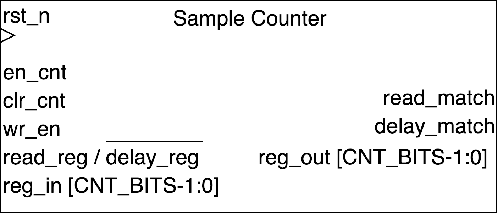

## Sample_Counter ##

{width=40%}

Counter module with pre-trigger count register and total sample count register. This module has flags that are asserted when the pre-trigger count is met and when total sample counts are met.

### Module functionality ###
This module is used to keep track of total samples in sample fifo. When the pre-trigger count is a met a flag is asserted. When the count meets the max samples then a flag is asserted.

### Parameters, Inputs and Outputs Descriptions ###
<!--- Nitty gritty module functionality stuff --->

#### Parameters ####

Parameter Name | Default Value | Description
--------------------- | ----------------------------- | -------------------------------------------------------------------------------------------

#### Inputs ####

Signal Name | Width | Signal Description
--------------------- | ----------------------------- | -------------------------------------------------------------------------------------------
clk | 1 | Input clock
reset_n | 1 | active low reset
en_cnt | 1 | Enable count up
clr_cnt | 1 | Set count to zero
wr_en | 1 | Enable writing to read and delay reg
read_reg_in | CNT_BITS-1:0| Max samples register, when this value is reached read_match is asserted
delay_reg_in | CNT_BITS-1:0| Pre-trigger samples register, when this value is reached delay_match is asserted

#### Outputs ####

Signal Name | Width | Signal Description
--------------------- | ----------------------------- | -------------------------------------------------------------------------------------------
read_match|1| asserted when read_reg_in value is met in counter
delay_match|1| asserted when delay_reg_in value is met in counter
read_reg_out|CNT_BITS-1:0| read_reg value output
delay_reg_out|CNT_BITS-1:0| read_reg value output