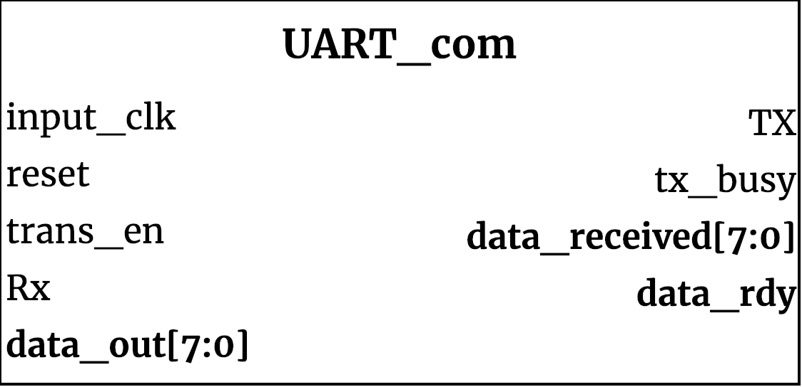

## UART_com ##

{width=40%}

this is a UART communication top level wrapper. Used to provide a single interface to the UART communication.

### Module functionality ###
This module is simply a wrapper module for UART communication. In order to send a transaction valid data should be provided on the data_out bus and trans enable should be asserted by the rising edge of input_clk. Transactions can be received at any time, data_rdy will be asserted and data_received will be valid for a single clock cycle.

### Parameters, Inputs and Outputs Descriptions ###
<!--- Nitty gritty module functionality stuff --->

#### Parameters ####

Parameter Name | Default Value | Description
--------------------- | ----------------------------- | -------------------------------------------------------------------------------------------
INPUT_CLK_KHZ |100_000| Input clock rate in KHz
BAUD_RATE |9600| Baud rate for transmission
#### Inputs ####

Signal Name | Width | Signal Description
--------------------- | ----------------------------- | -------------------------------------------------------------------------------------------
input_clk|1| Clock that should match the speed of INPUT_CLK_KHZ
reset_n|1| active low reset
trans_en|1| transmit enable assert when valid data is on data_out bus to start transmission
Rx|1| Receiver serial data pin
data_out| 7:0 | Data to be transmitted

#### Outputs ####

Signal Name | Width | Signal Description
--------------------- | ----------------------------- | -------------------------------------------------------------------------------------------
Tx|1| Transmission serial data pin
tx_busy|1| asserted while transmit module is sending data
data_rdy|1| asserted when data_receive has valid data
data_received | 7:0 | data received from receive module valid when data_rdy is asserted