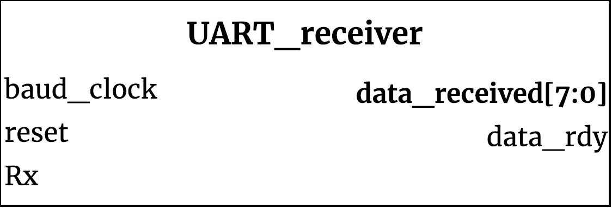

## UART_receiver ##

{width=40%}

Receive module for UART

### Module functionality ###

This module receives serialized bytes and collects them into a single byte. The received transmission is expected to follow the UART protocol.

### Parameters, Inputs and Outputs Descriptions ###
<!--- Nitty gritty module functionality stuff --->

#### Parameters ####

Parameter Name | Default Value | Description
--------------------- | ----------------------------- | -------------------------------------------------------------------------------------------
CLKS_PER_BIT | N/A | Number of clock ticks per bit (i_Clock/desired baud)

#### Inputs ####

Signal Name | Width | Signal Description
--------------------- | ----------------------------- | -------------------------------------------------------------------------------------------
i_Clock|1| input clock
i_Rx_Serial|1| serial input pin

#### Outputs ####

Signal Name | Width | Signal Description
--------------------- | ----------------------------- | -------------------------------------------------------------------------------------------
o_Rx_DV|1| asserted when o_Rx_Byte has a valid byte
o_Rx_Byte |7:0| received byte