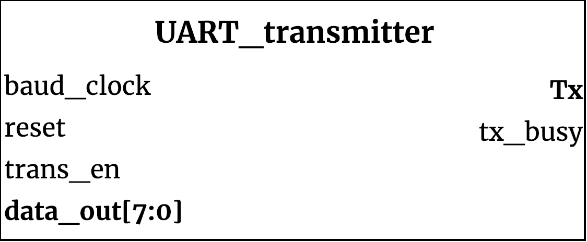

## UART_transmitter ##

{width=40%}

Transmission module for UART

### Module functionality ###

This module serializes bytes and transmits them through Tx. The transmission follows the UART protocol.

### Parameters, Inputs and Outputs Descriptions ###
<!--- Nitty gritty module functionality stuff --->

#### Parameters ####

Parameter Name | Default Value | Description
--------------------- | ----------------------------- | -------------------------------------------------------------------------------------------
CLKS_PER_BIT | N/A | Number of clock ticks per bit (i_Clock/desired baud)

#### Inputs ####

Signal Name | Width | Signal Description
--------------------- | ----------------------------- | -------------------------------------------------------------------------------------------
i_Clock|1| input clock
i_Tx_DV|1| Data valid signal to assert when i_Tx_Byte has valid data to send
i_Tx_Byte |7:0| Data to be transmitted

#### Outputs ####

Signal Name | Width | Signal Description
--------------------- | ----------------------------- | -------------------------------------------------------------------------------------------
o_Tx_Active|1| Signal asserted while transmission is busy
o_Tx_Serial|1| Serial pin i_Tx_Byte will be serialized through
o_Tx_Done|1| Asserted when transmission is completed