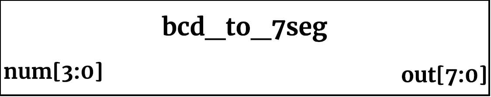

## bcd_to_7seg ##

{width=40%}

<!--- Module description goes here --->

This module is used to map Binary Coded Decimal values to specific leds used on a 7-segment display.

### Parameters, Inputs and Outputs Descriptions ###
<!--- Nitty gritty module functionality stuff --->

#### Inputs ####

| Signal Name | Width | Signal Description |
| --- | --- | --- |
| num | 4 | Binary coded decimal value |

#### Outputs ####

| Signal Name | Width | Signal Description |
| --- | --- | --- |
| out | 8 | 7 segment sections |