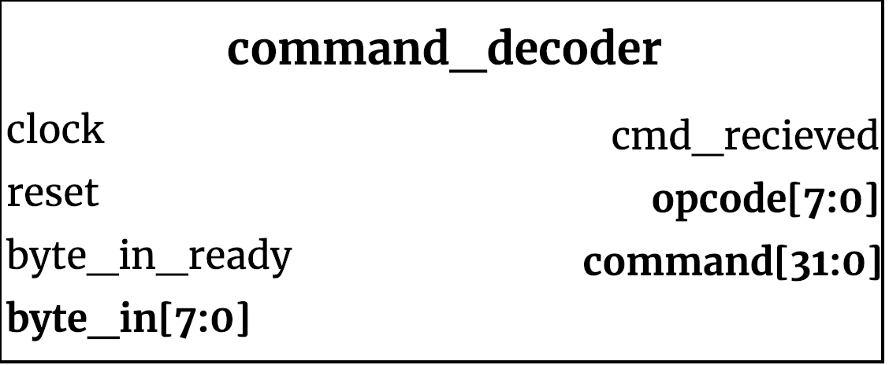

## command_decoder ##

{width=40%}

The communication protocol used by the device requires an `OPCODE` followed by four additional bytes referred to as the `COMMAND` bytes, which vary depending on the `OPCODE` given. Every command issued to the system needs to follow this five-byte format, shorter commands are not yet supported. This module receives and holds the bytes in order as they come in.

### Module functionality ###
This module contains a finite-state machine, which waits for incoming bytes from the transmitter (alerted when `byte_in_ready` asserted), placing them in order inside a 40-bit wide register. When the fifth byte is received, it places all five bytes into output registers, asserts `cmd_recieved` and returns to its IDLE state, awaiting to receive another transmission. Although `cmd_recieved` is only asserted for one clock cycle, the value in the output register will be held constant until a new five bytes are received and a new `cmd_recieved` is asserted.

#### Inputs ####

Signal Name | Width | Signal Description
--------------------- | ----------------------------- | -------------------------------------------------------------------------------------------
    clock | 1 |  System Clock
    reset_n | 1 | Reset (active low)
    byte_in_ready | 1 | Transmitter signal alerting a byte has been received in the buffer.
    byte_in | 8 | Data byte to store in internal register.

#### Outputs ####

Signal Name | Width | Signal Description
--------------------- | ----------------------------- | -------------------------------------------------------------------------------------------
    cmd_recieved | 1 | After five bytes have been sent, asserted for one clock cycle. 
    opcode | 8 | First byte in sequence.
    command | 32 | Four data/command bytes.
   
