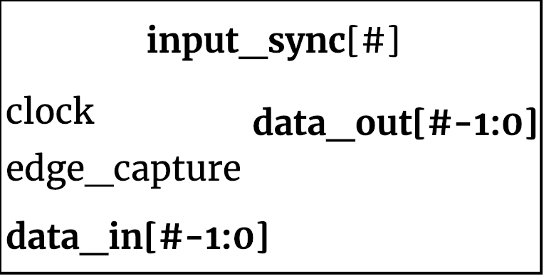

## input_sync ##

{width=40%}

This simple module handles the raw data stream from users DUT. Currently it handles sampling at full clock data rate with a trigger on either the either the positive or negative edge of the clock.

### Interface Definitions ###

### Module functionality ###
The Input Synch module serves as a front door to the users DUT input. This is the first module to see the data as it comes in. This module will run at the full system clock to sample the incoming data. The module will recieve signal from the controller to choose positive edge or negative edge sampling.

### Parameters, Inputs and Outputs Descriptions ###

#### Parameters ####

Parameter Name | Default Value | Description
--------------------- | ----------------------------- | -------------------------------------------------------------------------------------------
WIDTH | 8 | Width of the sampling bus

#### Inputs ####

Signal Name | Width | Signal Description
--------------------- | ----------------------------- | -------------------------------------------------------------------------------------------
clk | 1 | Full speed system clock
edge_capture | 1 | Choose either positive edge sampling (1) or negative edge sampling (0)
data_in | WIDTH-1:0 | data coming from user DUT bus

#### Outputs ####

Signal Name | Width | Signal Description
--------------------- | ----------------------------- | -------------------------------------------------------------------------------------------
data_out | WIDTH -1:0 | Sampled data leaving synch
