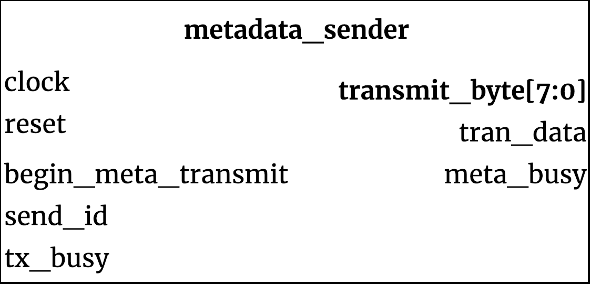

## metadata_sender ##

{width=40%}

The metadata_sender is a module responsible for communicating fixed strings of metadata to UART when requested.

### Module functionality ###
When `begin_meta_transmit` is asserted by the control unit, the unit places bytes of requested metadata onto the `transmit_byte` wire. It waits until `tx_busy` is not asserted, then it asserts its `tran_data` signal to send the next byte. 
The ordering of the metadata follows the standards laid out by sigrok, which is as follows:

| Response Code | Data |
| -------------- | ------------------------------------------------ |
|0x01 | Device Name String
| 0x02 | FPGA Firmware Version |
| 0x21 | Amount of sample memory available on the device |
| 0x23 | Maximum sample rate |
| 0x40 | Maximum number of probes |
| 0x41 | Sigrok Protocol Version |

If `send_id` is asserted, it will send only the four byte product ID.

When the module has finished transmitting the sequence of bytes, it will deassert `meta_busy` alerting the control unit the transmission resource is now available.

#### Inputs ####

Signal Name | Width | Signal Description
--------------------- | ----------------------------- | -------------------------------------------------------------------------------------------
clock | 1 | System Clock
reset_n | 1 | Reset (active low)
begin_meta_transmit | 1 | Alerts the unit to transmit its metadata
send_id | 1 | If high, sends ID, if low, sends Query Metadata
tx_busy | 1 | Signal from transmitter, high if busy transmitting
#### Outputs ####

Signal Name | Width | Signal Description
--------------------- | ----------------------------- | -------------------------------------------------------------------------------------------
transmit_byte | 8 | Byte to transmit
tran_data | 1 | Requests transmitter to send the next byte
meta_busy | 1 | Status signal back to controller when operation complete
