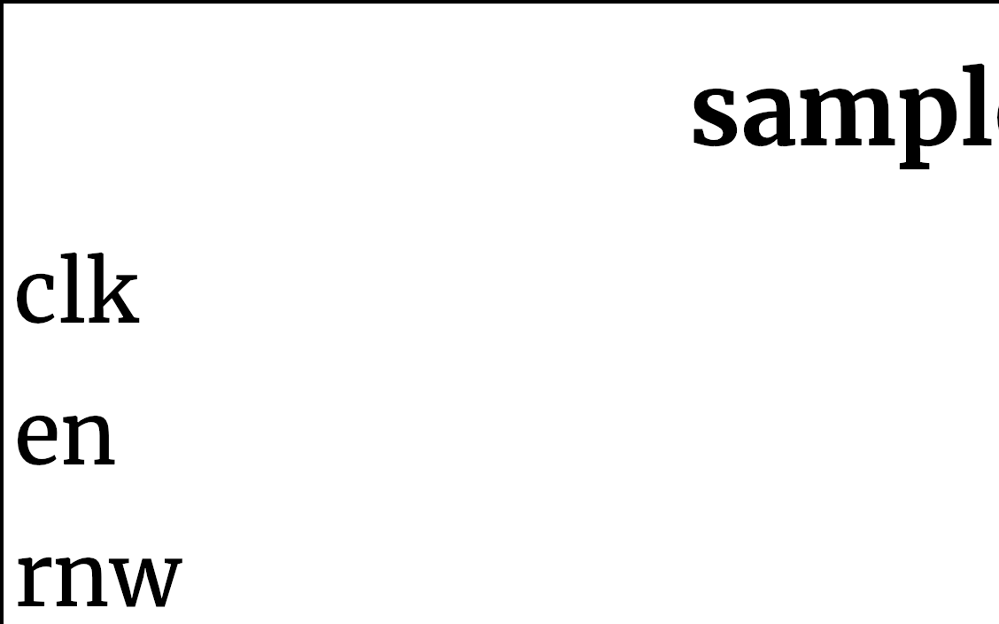

## sample_fifo ##

{width=40%}

The sample FIFO is used to store the data sampled from the users device. This module is written to fit into the block ram resource of the FPGA. 

### Module functionality ###
<!--- Nitty gritty module functionality stuff --->
This FIFO is designed with functionality specific to sampling the users device. Reads and writes cannot be performed simultaneously and instead rely on a read not write (rnw) signal to choose. In order to do a read or write the rnw signal must be set appropriately and en asserted on the rising edge of the clock. For writes the data on data_in must be valid by the rising edge when en is asserted and rnw is deasserted. For reads the data will be on the data_out bus the clock after en and rnw are asserted on a rising edge. The data_valid signal will be asserted along with the data on the data_out bus.
### Parameters, Inputs and Outputs Descriptions ###
<!--- Nitty gritty module functionality stuff --->

#### Parameters ####
Module has no parameters.

#### Inputs ####

Signal Name | Width | Signal Description
--------------------- | ----------------------------- | -------------------------------------------------------------------------------------------
clk| 1 | System Clock
en| 1 | Enable
rnw| 1 | Read not write when high a read will be performed on enable, when low a write will be performed on enable
clear| 1 | sets read and write pointers to zero, empty will be asserted
hold_window| 1 | increments read and write pointers simultaneously on writes
reset_n| 1 | active low reset signal to reset read and write pointers to zero
data_in|7:0| data to be stored on write

#### Outputs ####

Signal Name | Width | Signal Description
--------------------- | ----------------------------- | -------------------------------------------------------------------------------------------
full | 1 | Asserted when the FIFO is full (no writes should be performed when asserted)
empty | 1 | Asserted when the FIFO is empty (no reads should be performed when asserted)
data_valid | 1 | Asserted after a read is requested when valid data is on the bus
data_out| 7:0 | data to read from memory, only valid when data_valid is asserted