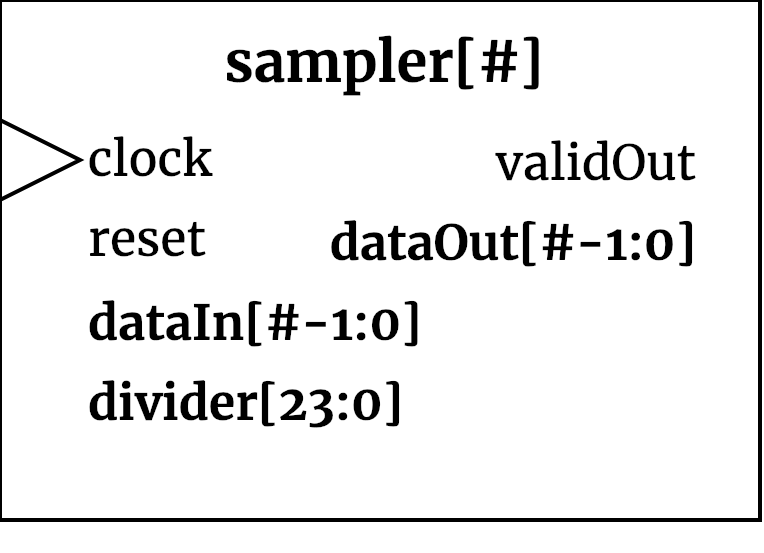

## sampler ##

{width=40%}

The `sampler` module controls the sampling rate of the device using an internal  match counter. 

### Module functionality ###
In order to scale down the sampling rate of the device, a signal must placed onto `divider` and loaded using the `load_counter` enable to store the value into the sampler's registers. The relation between the sampling rate and the divider follows the given equation:

divider = (clock / sample-rate) - 1 

This is enforced using an internal counter, counting the number of clock cycles since the last valid sample. A sample is "valid" if it meets the sampling rate conditions. For example, to sample at 100KHz, the divider will need to be set to 999, as there will be 999 clock ticks between two valid samples.
#### Inputs ####

Signal Name | Width | Signal Description
--------------------- | ----------------------------- | -------------------------------------------------------------------------------------------
    clock | 1 | System Clock
    load_counter | 1 | Load enable to store `divider` into internal register  
    dataIn | SAMPLE_WIDTH | Data being sampled.
    divider | 24 | Number of rising edges on `clock` before a valid is asserted

#### Outputs ####

Signal Name | Width | Signal Description
--------------------- | ----------------------------- | -------------------------------------------------------------------------------------------
     dataOut | SAMPLE_WIDTH | Sample data output, sent to the FIFO for storage
     validOut | 1 | Asserted when `dataOut` is a valid sample
