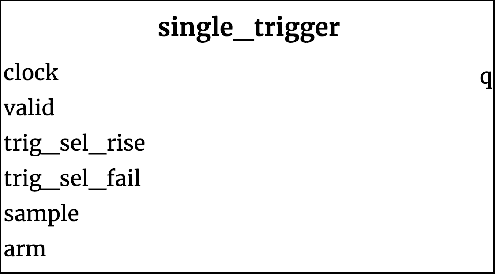

## single_trigger ##

{width=40%}

For each channel in the `trigger_basic`, one `single_trigger` is created. The module consits of a single flip-flop which is used to compare a high or low signal from a previous cycle in a way defined by the basic trigger.

### Module functionality ###
When the arm signal is asserted, the module sets its flip-flop to zero if it is to trigger on rising or falling. If the channel is not a trigger condition, it will be set to 1.

If the `single_trigger` is currently in a clock cycle where a valid sample has been asserted, then it will check (if it has been enabled) for a rising/falling edge, relative to the last valid sample. If it detects a selected trigger condition, it will set the flip-flop to 1.  

#### Inputs ####

Signal Name | Width | Signal Description
--------------------- | ----------------------------- | -------------------------------------------------------------------------------------------
clock |1| System Clock
valid|1| Valid signal sent from sampler device. Module will only compare valid samples.
trig_sel_rise|1| Asserted if checking for rising edge.
trig_sel_fall|1| Asserted if checking for falling edge.
sample|1| Input bit to compare.

#### Outputs ####

Signal Name | Width | Signal Description
--------------------- | ----------------------------- | -------------------------------------------------------------------------------------------
arm|1|Asserted High when triggered, or when not a trigger condition.