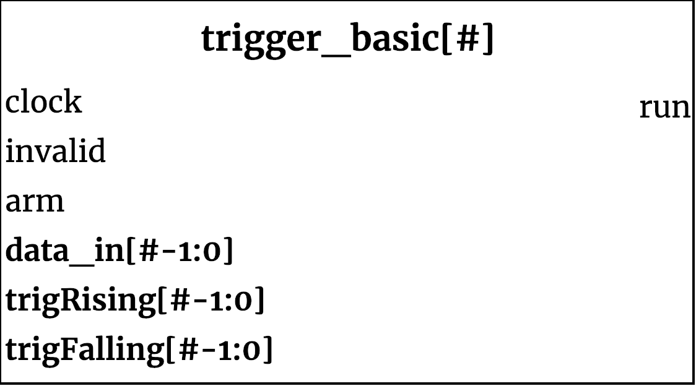

## trigger_basic ##

{width=40%}

The basic trigger is a configurable module that generates a trigger signal when it detects a selected rising or falling edge combination across all the channels. 

### Module functionality ###
This module allows for detection of rising or falling edge across a parameterized number of channels. The post-reset state of the device clears the internal registers holding the `trigRising` and `trigFalling` values, and needs to be set using `load_trigs` prior to `arm` in order to allow for any triggring to occour.

Once triggered, the `run` will be asserted for one and only one clock cycle. Even with repeated triggering conditions, it will not reassert `run` until the device is given an `arm` signal again; at least once clock rising edge prior. 

#### Inputs ####

Signal Name | Width | Signal Description
--------------------- | ----------------------------- | -------------------------------------------------------------------------------------------
    clock | 1 | System Clock
    reset_n | 1 | Reset Signal (Active Low)
    valid |1| Valid bit, asserted high when `dataIn` is valid sample
    arm| 1 | Control signal, arming the trigger
    load_trigs | 1 | Load enable the rising/falling values into the module's registers             
    dataIn | SAMPLE_WIDTH - 1 | Sample data, parametrized  number of channels  
    trigRising | SAMPLE_WIDTH - 1 | Check for rising edges across the channels.
    trigFalling | SAMPLE_WIDTH - 1 | Check for falling edge across the channels.
#### Outputs ####

Signal Name | Width | Signal Description
--------------------- | ----------------------------- | -------------------------------------------------------------------------------------------
run | 1 | Signal asserted once whenever trigger condition met across all channels
